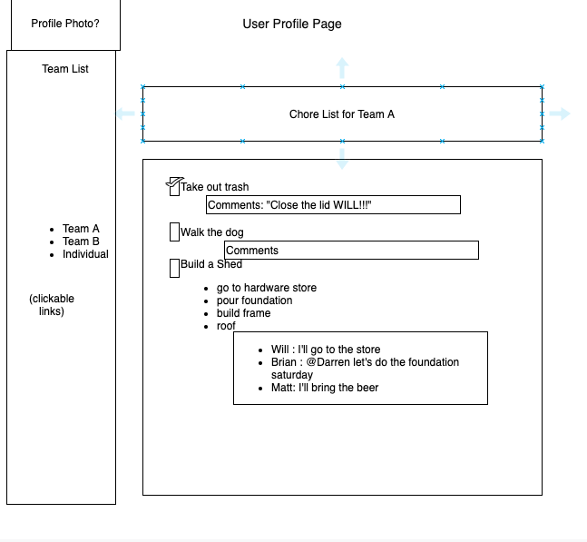
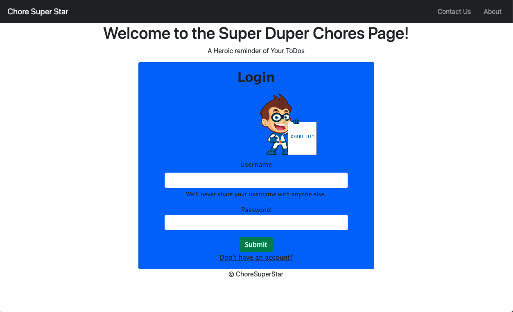

# Super Duper Chores

## Description
A simple app that allows users to create and track team chores and tasks.

## Application
Users sign up by supplying a unique username and a password. Once registered, users create teams with fellow registered users. From their individual page, each user will be able to navigate their different teams. Each team renders a specific team page where users can create and comment on shared chores. After the chore is completed, the user has the option to remove the chore from their to do list.

## Technologies
Built with: Node.js, Express, PostgreSQL, HTML, and CSS.

## How It Started...

## How It's Going...
<h3>Login<h3>

## Check back with this repo after we take it live!

